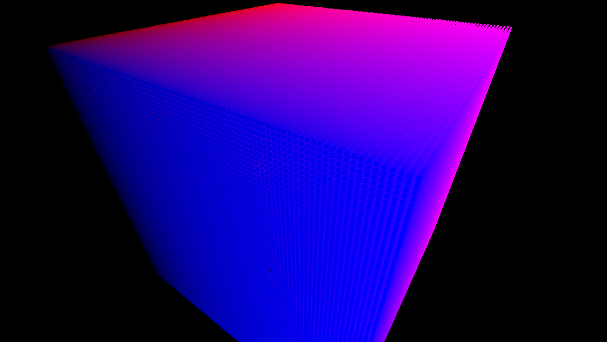

# Blog

## 12.7.2026
So far it's possible to render 1 Million cube instances with 1 draw call. 



# Building & Running
## Requirements

Before building the project, install the required dependencies.

---

## Linux

Tested on Fedora.

### Build Tools

```bash
sudo dnf install make gcc-c++
```

### Libraries

```bash
sudo dnf install \
    glm-devel \
    vulkan-loader-devel \
    vulkan-headers \
    vulkan-validation-layers \
    glfw-devel
```

### DirectX Shader Compiler (DXC)

Download the latest Linux release from:

https://github.com/microsoft/DirectXShaderCompiler/releases

Extract the archive:

```bash
tar -xf linux_dxc*.tar.gz
```

Install the compiler and its shared libraries:

```bash
sudo cp bin/dxc /usr/local/bin/
sudo cp lib/libdxcompiler.so* /usr/local/lib/
sudo ldconfig
```

Verify the installation:

```bash
dxc --version
```

### Build

From the project root:

```bash
cd ProjectFolder
```

Generate the project files:

```bash
./scripts/generateProjects.sh
```

Compile the shaders:

```bash
./scripts/compileShaders.sh
```

Build the project:

```bash
make config=debug
```

Available build configurations:

```text
debug
release
dist
```

### Run

Start the debug build:

```bash
./bin/Debug-linux-x86_64/game/game
```

---

## Windows

### Build Tools

Install Visual Studio 2022 with the following workload:

```text
Desktop development with C++
```

Make sure the following components are installed:

```text
MSVC v143 C++ build tools
Windows 10 SDK or Windows 11 SDK
```

### Vulkan SDK

Download and install the Vulkan SDK from:

https://vulkan.lunarg.com/sdk/home

The installer should create the following environment variable:

```text
VULKAN_SDK
```

Open a new PowerShell or Command Prompt window after installation and verify it:

```powershell
$env:VULKAN_SDK
```

You can also verify that the Vulkan compiler tools are available:

```powershell
& "$env:VULKAN_SDK\Bin\dxc.exe" --version
```

### vcpkg

Clone vcpkg:

```powershell
cd C:\Users\YourUser\dev
git clone https://github.com/microsoft/vcpkg.git
cd vcpkg
```

Bootstrap vcpkg:

```powershell
.\bootstrap-vcpkg.bat
```

Install GLFW and GLM:

```powershell
.\vcpkg.exe install glfw3:x64-windows glm:x64-windows
```

Enable the user-wide Visual Studio integration:

```powershell
.\vcpkg.exe integrate install
```

This command only needs to be run once for the current Windows user.

The generated Visual Studio projects can then use installed vcpkg libraries without manually configuring their include and library directories.

Verify the installed packages:

```powershell
.\vcpkg.exe list
```

The output should contain:

```text
glfw3:x64-windows
glm:x64-windows
```

### Build

From the project root:

```powershell
cd C:\Path\To\CPE
```

Generate the Visual Studio 2022 solution:

```powershell
.\scripts\generateProjects.bat
```

Compile the shaders:

```powershell
.\scripts\compileShaders.bat
```

Open the generated solution:

```powershell
Start-Process .\CPE.sln
```

In Visual Studio, select one of the following configurations:

```text
Debug
Release
Dist
```

Make sure the platform is set to:

```text
x64
```

Build the solution using:

```text
Build → Build Solution
```

Alternatively, use the keyboard shortcut:

```text
Ctrl+Shift+B
```

### Run

Set `game` as the startup project in Visual Studio:

```text
Right-click game → Set as Startup Project
```

Run the project without the debugger:

```text
Ctrl+F5
```

Or run it with the debugger:

```text
F5
```

The debug executable is generated at:

```text
bin\Debug-windows-x86_64\game\game.exe
```

The working directory is configured through Premake, allowing the game to load assets and compiled shaders using project-relative paths.

---

## Shader Compilation

The HLSL shader source is located at:

```text
game/assets/shaders/main.hlsl
```

It contains the following entry points:

```text
VSMain
PSMain
```

The shader scripts generate:

```text
game/assets/shaders/bin/main.vert.spv
game/assets/shaders/bin/main.frag.spv
```

### Linux

```bash
./scripts/compileShaders.sh
```

### Windows

```powershell
.\scripts\compileShaders.bat
```

The shader compiler uses the following profiles:

```text
VSMain → vs_6_0
PSMain → ps_6_0
```

The generated SPIR-V files are loaded by the Vulkan renderer at runtime.

---

## Cleaning Generated Files

### Linux

```bash
./scripts/clean.sh
```

### Windows

Close Visual Studio before cleaning the project because Visual Studio may keep files inside `.vs` locked.

Then run:

```powershell
.\scripts\clean.bat
```

The clean scripts remove generated files such as:

```text
bin
bin-int
.vs
CPE.sln
*.vcxproj
*.vcxproj.filters
*.vcxproj.user
```

Source files, assets, shaders and Premake files are not removed.

---

## Troubleshooting

### `VULKAN_SDK` Is Not Set

Close and reopen PowerShell, Command Prompt and Visual Studio after installing the Vulkan SDK.

Verify the variable:

```powershell
$env:VULKAN_SDK
```

### GLFW or GLM Headers Cannot Be Found

Verify that the packages are installed:

```powershell
cd C:\Users\YourUser\dev\vcpkg
.\vcpkg.exe list
```

Install missing packages:

```powershell
.\vcpkg.exe install glfw3:x64-windows glm:x64-windows
```

Enable the Visual Studio integration:

```powershell
.\vcpkg.exe integrate install
```

Restart Visual Studio afterwards.

### `glfw3.dll` Cannot Be Found

The default `x64-windows` vcpkg triplet uses the dynamic GLFW library.

The DLL is normally located at:

```text
vcpkg\installed\x64-windows\bin\glfw3.dll
```

For debug builds:

```text
vcpkg\installed\x64-windows\debug\bin\glfw3.dll
```

Ensure that the appropriate DLL is copied next to `game.exe` during the build.

### Shader Files Cannot Be Opened

Compile the shaders before running the game:

```powershell
.\scripts\compileShaders.bat
```

Verify that these files exist:

```text
game/assets/shaders/bin/main.vert.spv
game/assets/shaders/bin/main.frag.spv
```

Also ensure that the Visual Studio working directory is generated correctly through the Premake configuration.

### Premake Cannot Be Found

The Windows Premake executable should be located at:

```text
scripts\premake5.exe
```

The Linux Premake executable should be located at:

```text
scripts/premake5
```

Generate the project files through the provided scripts instead of calling Premake directly.
