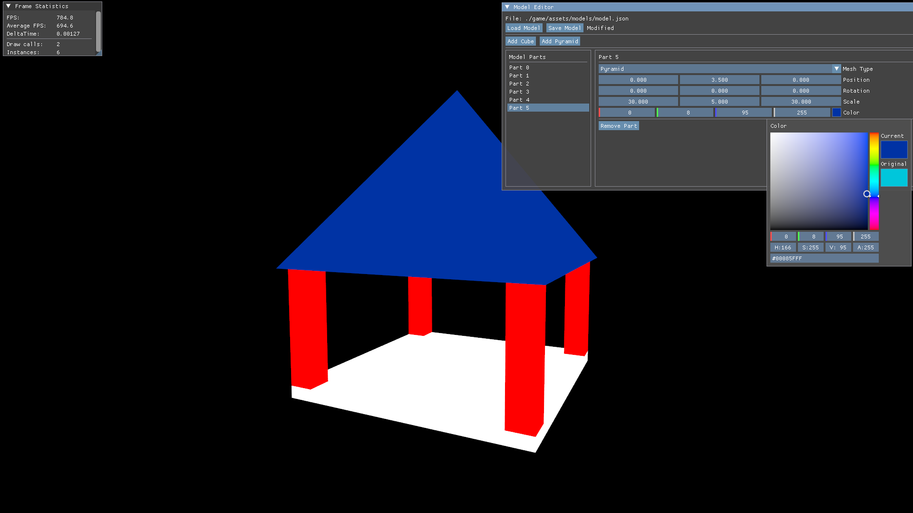
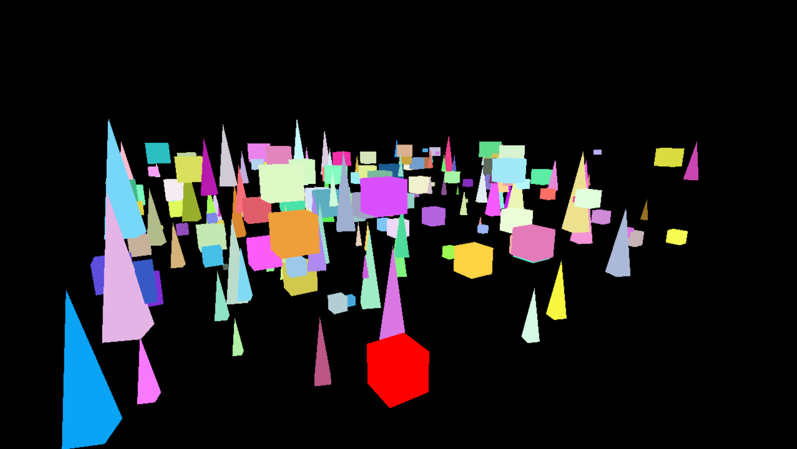
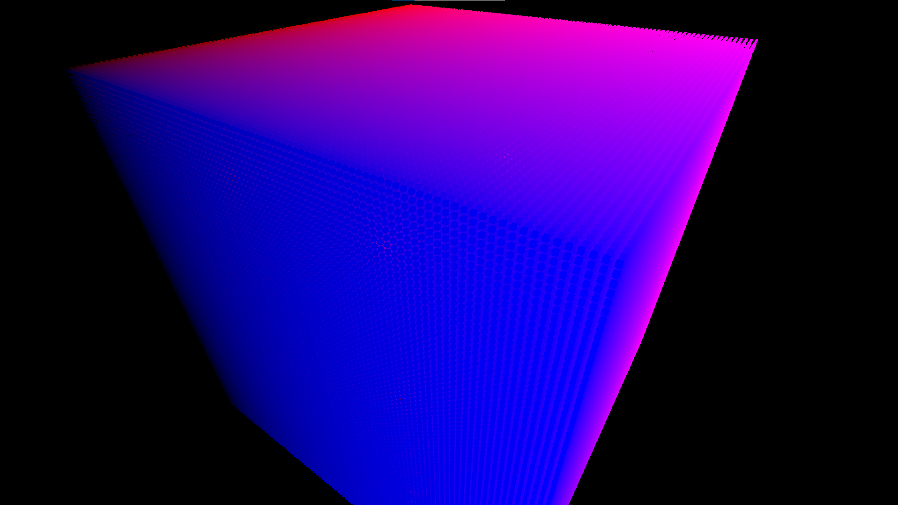

# CPE

A Vulkan rendering engine written in C++20.

# Blog

## 8.8.2026

Added a small model editor and a frame statistics ImGui window. Also added antialiasing.


## 20.7.2026

It is now possible to render multiple meshes.



## 12.7.2026

The engine can render one million cube instances with a single draw call.



# Building and Running

## Linux

Tested on Fedora.

### Install dependencies

```bash
sudo dnf install make gcc-c++ glm-devel glfw-devel json-devel vulkan-loader-devel vulkan-headers vulkan-validation-layers
```

Install the DirectX Shader Compiler:

```bash
tar -xf linux_dxc*.tar.gz
sudo cp bin/dxc /usr/local/bin/
sudo cp lib/libdxcompiler.so* /usr/local/lib/
sudo ldconfig
```

### Build

From the project root:

```bash
./scripts/generateProjects.sh
./scripts/compileShaders.sh
make config=debug
```

Available configurations:

```text
debug
release
dist
```

### Run

```bash
./bin/Debug-linux-x86_64/game/game
```

## Windows

### Requirements

Install:

* Visual Studio 2022 with **Desktop development with C++**
* Vulkan SDK
* Git

### Set up vcpkg

```powershell
git clone https://github.com/microsoft/vcpkg.git C:\vcpkg
cd C:\vcpkg
.\bootstrap-vcpkg.bat
.\vcpkg.exe integrate install
```

The dependencies declared in `vcpkg.json` are installed automatically during the Visual Studio build.

### Build

From the project root:

```powershell
.\scripts\generateProjects.bat
.\scripts\compileShaders.bat
Start-Process .\CPE.sln
```

In Visual Studio:

1. Select `Debug`, `Release` or `Dist`.
2. Select the `x64` platform.
3. Set `game` as the startup project.
4. Build with `Ctrl+Shift+B`.
5. Run with `F5` or `Ctrl+F5`.

The debug executable is generated at:

```text
bin\Debug-windows-x86_64\game\game.exe
```

# Shader Compilation

Shader source:

```text
game/assets/shaders/main.hlsl
```

Generated SPIR-V files:

```text
game/assets/shaders/bin/main.vert.spv
game/assets/shaders/bin/main.frag.spv
```

Compile manually when required:

```bash
./scripts/compileShaders.sh
```

```powershell
.\scripts\compileShaders.bat
```

# Cleaning

## Linux

```bash
./scripts/clean.sh
```

## Windows

Close Visual Studio and run:

```powershell
.\scripts\clean.bat
```
