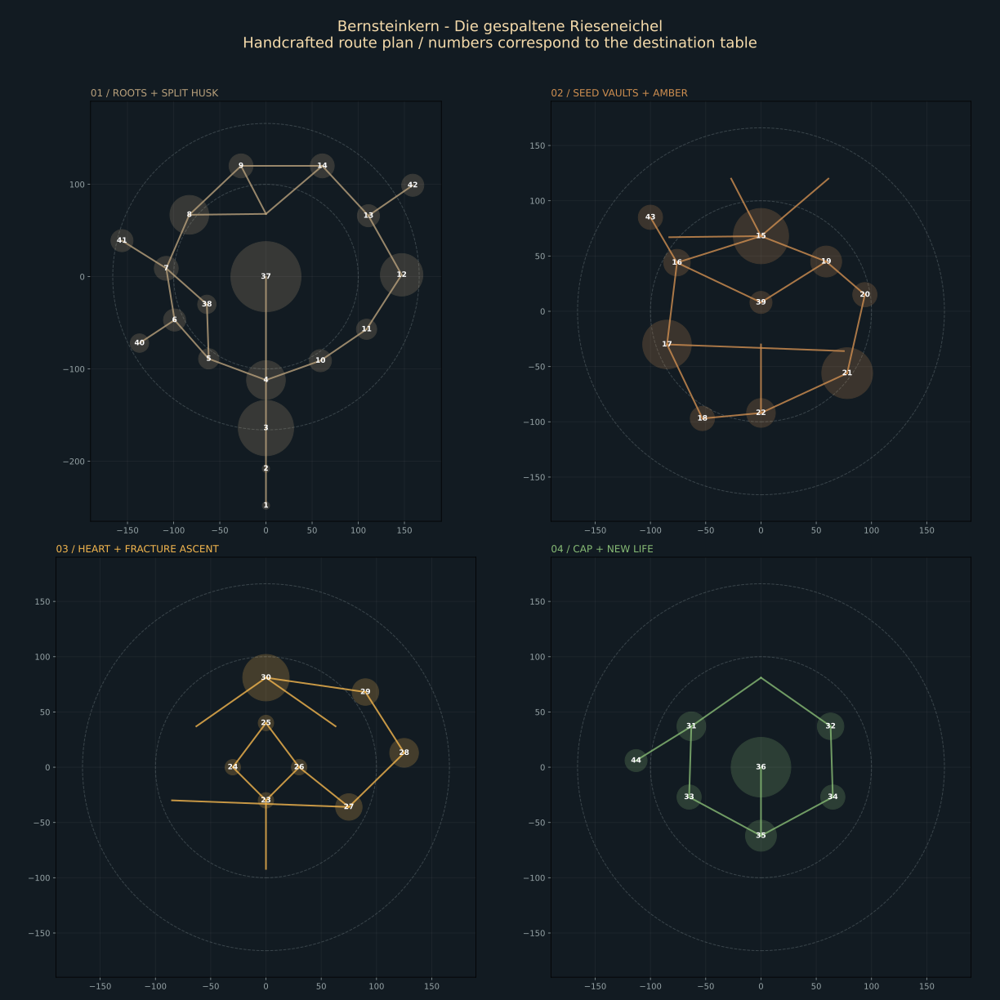

# Bernsteinkern - Die gespaltene Rieseneichel

The dungeon occupies a fractured acorn, from the pilgrim roots through the husk,
seed cavity and amber heart to the cap and new sprout. The composition spans
approximately **355 by 429 units**, with **184 units of playable ascent** and a
sprout reaching approximately +244. The terrain approach extends south to -300.
The old entrance furniture, root arches, shell ribs, arena, cap scales, heart and
sprout remain in use. All thirteen original models are unchanged.



## Anatomy and progression

The furnished pilgrim road starts at Z=-252. Its four retained side rooms precede
the enlarged root archway and the southern shell wound. The giant shell is visible
through the arches. The old 76-unit arena remains at the bottom of the seed cavity;
its southern opening is reached directly from Split Husk. It is a quiet exploration
branch and a useful early view upward, rather than the final encounter.

From Split Husk, the west route follows enclosed fracture galleries and Seed Vault.
The east route enters the Root Wound, passes outside through Root Breach and returns
through Exposed Seed. Both reach the northern shell junctions, then the Great Seed
Chamber at +48. The outer profile follows the original five-segment ribs, with a
tapered lower husk beneath them. Three small rib variants open specific lower and
upper fractures; the intact original ribs still define most of the silhouette.

Inner lamellae at +3, +40, +80 and +122 distinguish the protective layers. Galleries
and small vaults occupy the spaces between them. Tissue panels leave route apertures
and views into the central cavity. The east rupture recurs at Root Breach (+24),
Vein Gallery (+64), Fracture Crossing (+128) and the upper wound (+140).

The Great Seed Chamber opens into a tall central void. Its northern combat shelf
provides the first audited view of the heart. The west branch passes Seed Memory,
Inner Sanctum and Sanctum Balcony; the east branch visits Amber Reservoir, Vein
Gallery and Amber Cathedral. They reunite at Core Threshold (+88). The original
heart, doubled in size and centered at +124, hangs inside a traversable four-sided
dais at +104. Filaments attach the dais to the upper arena's underside. The heart's
lower tip stays above the walking surface, and the middle of the dais remains open.

Crack Balcony leads outside to Fracture Crossing, then through Upper Wound to Cap
Interior (+152). The inner and outer cap paths divide around the hollow, meet at
Sprout Sanctuary (+176), and reach the 54-unit final arena at +184. Staggered scale
courses form a dense cap above these paths. The retained sprout emerges at the arena
edge, leaving the boss's central 40-unit movement diameter clear. There are no
required jumps, drops, interactable doors or invented seed-pod mechanics.

## Route choices and encounters

There are 44 mapped destinations, four additional original furnished rooms, 52
connections and nine independent cycles. Larger encounter floors occur at Split
Husk, Root Breach, Seed Vault, Great Seed Chamber, Inner Sanctum, Amber Cathedral,
Cap Interior and the final arena. The heart bridges provide a separate, narrower
combat pattern. Small shelves, passages and five optional chambers supply contrast.

The important loops have different architectural character:

- Western shell galleries versus the exposed, root-invaded eastern shell.
- Seed vaults and the inner sanctum versus the growing amber-vein district.
- The shell wicket versus the outer fracture gallery.
- The cotyledon bridge versus the Great Seed Chamber's northern shelf.
- The cap's windward exterior versus the living inner seam.

Two especially useful reversible shortcuts are the narrow Seed Vault bridge into
Great Seed Chamber (about 86 units instead of 138 through Shell Junction) and the
inclined collapsed-shell crossing from Inner Sanctum to Crack Balcony (about 169
instead of 297 through the heart approach). They offer recognizable return views
and allow alternate progression without pretending that static geometry is locked.

The optional Husk Shrine, Buried Cotyledon, Root Nursery, Seed Archive and Quiet
Germ are intentional out-and-back rooms. The first four original pilgrim rooms
retain their real door openings and furnishings. No optional room is presented as
a connection to an area it does not reach.

Thirty-six guards use existing barkguard, rootcharger, thornshooter and crawler
behavior. Their placements stay on flat floors, away from thresholds. The existing
Thornwolf boss now spawns at +184 with a 20-unit movement radius. World placement
moves Bernsteinkern to radius 720, reserves its expanded footprint, surveys terrain
under it and joins the existing terrain staircase to the new front at Z=-252.

## Assets, light and collision

The final prefab contains 546 model instances, 2,415 shape parts and 21 active
model-light sources. Thirteen small new modules supplement the thirteen originals:
shell platforms, bridges, lamellae, buttresses, curbs, amber veins, reliquaries,
shards, extracted pilgrim furniture, three breached-rib variants and the tapered
lower husk. The biggest new module is the fourteen-shape reused furnishing set.
There is no runtime generator or new engine system.

The original five-material palette carries the design. Brown outer tissue becomes
pale inner shell, amber crystals and finally moss-green cap scales. Pods mark
selected decisions, sheltered room edges and active veins. Their existing point
lights and the original heart light provide navigation; small crystal veins use
the already supported emissive material. The cap is physically open to the sky.

Walking decks, platforms, shell walls, ribs, boundaries and root arches generate
mesh collision. Small furnishings, pod clusters, cap scales, sprout and amber
details do not generate expensive decorative collision. The audit nevertheless
checks these decorations for visible intrusion into the player route. Flat bridges
sit 0.04 units below connecting floors to avoid coplanar joins; inclined bridge
surfaces follow their actual walking plane. The steepest ramp is approximately
22.5 degrees. The audited central lanes range from approximately 4 to 8 units wide,
inside decks that are 7 to 14 units wide.

Measured original geometry, before prefab transforms (conservative X / Y / Z bounds):

| Model | Local bounds and use |
| --- | --- |
| foundation | -40..40 / -80.6..-0.6 / -108..40; original approach footing |
| walkway | -32..32 / -0.64..0.07 / -40..38; broad floor with narrower north tongue |
| arena_floor | -38..38 / -0.6..0.04 / -38..38; 76-unit disc with floor inlay |
| arena_rim | -39..39 / 0..3 / -35.28..39; southern opening |
| shell_rib | 7.21..48.46 / -0.98..68.37 / -3.5..3.5; five inclined cube segments |
| cap_scales | -4.5..27.23 / -3..3 / 19.92..37; five overlapping ellipsoidal scales |
| sprout | -1.9..24.19 / -0.63..22.57 / -2..6; bent stem and single broad leaf |
| amber_heart | -9.3..9.3 / -8..24 / -9.3..9.3; crystal, surrounding ring and suspension |
| root_arch | -18.5..18.5 / -0.16..28.08 / -2.5..2.5; four angled timber segments |
| root_rail | -2..2 / -1.4..4.46 / -0.53..17.33; uneven root with mossy swelling |
| seed_pod | -2.75..2.75 / 0..8 / -2.75..2.75; light at +7, original radius 13 |
| furnished_rooms | -31.5..31.5 / 0.04..10.44 / -104.7..-41.3; four rooms, benches and offerings |
| approach_step | -0.5..0.5 / -1..0 / -0.5..0.5; unit tread with top at origin |

Dimensions come from the JSON shape transforms and engine primitive dimensions.
Rotations are radians, applied X then Y then Z. Instance transforms follow model
transforms. Prefab children resolve relative to the prefab and must be shape models.
Material indices remain local. No unsupported asset fields were added.

## Validation

Run the read-only audit against the checked-in files:

```powershell
python -B scripts/acorn_dungeon_audit.py
```

The audit reuses the existing mushroom content tool's transformed primitive geometry
helpers. It does not export or rewrite assets. Route names and coordinates live in
the audit, outside the game schema. If the layout changes, update those annotations
alongside the actual prefab.

The structural blockout was checked before decoration. The finished layout passes
16,470 walking, clearance, combat-floor, guard and boss-area samples. Checks include
the 0.4-unit player capsule, 2.4-unit height, 0.5-unit step tolerance, all 52 links,
all optional entries, original side-room doors, model references, JSON fields,
materials, finite transforms, positive scales, light flags and CRLF model files.
Three explicit rays check the first heart reveal, a return view from Crack Balcony
and the future Fracture Crossing seen from below. The complete geometry stays inside
the world reservation and the five-chunk streaming envelope, including the approach.

All 26 acorn model JSON files and the prefab parse with PowerShell ConvertFrom-Json.
The Debug game build, including its engine dependency, passes. A geometry preview
was reviewed separately from the four-band route map.

This is static geometry validation, not a controller simulation or a GUI playtest.
Runtime camera occlusion, lighting exposure, enemy pursuit over ramps, encounter
pacing and frame time still need in-game review.

## Map destinations

Coordinates below are local to the prefab; Y is the walking surface.

| No. | Destination | X / Y / Z |
| --- | --- | --- |
| 1 | Pilgrim threshold | 0 / 0 / -248 |
| 2 | Pilgrim road | 0 / 0 / -208 |
| 3 | Root archway | 0 / 0 / -164 |
| 4 | Split husk | 0 / 0 / -112 |
| 5 | West shell gate | -62 / 8 / -89 |
| 6 | Fracture gallery | -99 / 16 / -47 |
| 7 | Husk watch | -108 / 24 / 9 |
| 8 | Seed vault | -83 / 32 / 67 |
| 9 | Shell junction | -27 / 40 / 120 |
| 10 | East shell gate | 59 / 8 / -91 |
| 11 | Root wound | 109 / 16 / -57 |
| 12 | Root breach | 147 / 24 / 2 |
| 13 | Exposed seed | 111 / 32 / 66 |
| 14 | North husk | 61 / 40 / 120 |
| 15 | Great seed chamber | 0 / 48 / 68 |
| 16 | Seed memory | -76 / 56 / 44 |
| 17 | Inner sanctum | -85 / 68 / -30 |
| 18 | Sanctum balcony | -53 / 80 / -97 |
| 19 | Amber reservoir | 59 / 56 / 45 |
| 20 | Vein gallery | 94 / 64 / 15 |
| 21 | Amber cathedral | 78 / 76 / -56 |
| 22 | Core threshold | 0 / 88 / -92 |
| 23 | Heart south | 0 / 104 / -30 |
| 24 | Heart west | -30 / 104 / 0 |
| 25 | Heart north | 0 / 104 / 40 |
| 26 | Heart east | 30 / 104 / 0 |
| 27 | Crack balcony | 75 / 116 / -36 |
| 28 | Fracture crossing | 125 / 128 / 13 |
| 29 | Upper wound | 90 / 140 / 68 |
| 30 | Cap interior | 0 / 152 / 81 |
| 31 | Cap west | -63 / 160 / 37 |
| 32 | Cap east | 63 / 160 / 37 |
| 33 | Windward scales | -65 / 168 / -27 |
| 34 | Living seam | 65 / 168 / -27 |
| 35 | Sprout sanctuary | 0 / 176 / -62 |
| 36 | Final arena | 0 / 184 / 0 |
| 37 | Empty seed bowl | 0 / 0 / 0 |
| 38 | Shell wicket | -64 / 16 / -30 |
| 39 | Cotyledon bridge | 0 / 56 / 8 |
| 40 | Husk shrine | -137 / 16 / -72 |
| 41 | Buried cotyledon | -156 / 24 / 39 |
| 42 | Root nursery | 159 / 32 / 99 |
| 43 | Seed archive | -100 / 56 / 85 |
| 44 | Quiet germ | -113 / 160 / 6 |
