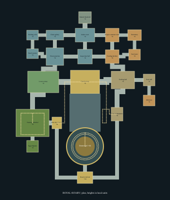

The royal aviary surrounds the original cage with a prison complex spanning roughly
290 by 355 units (about 395 units including the terrain approach). The cage stays
at local (0, 0, 0); the world places the whole complex farther northeast, at radius
520, to keep it clear of the spawn temple and the other three dungeons.



The entrance splits at the Intake Court. The west route passes holding cells and
the Prison Junction before opening into the Lower Aviary. The east route visits
keeper rooms, a kitchen and feeding infrastructure. Both reconnect through the
Inspection Hall and converge at the Grand Aviary. Its north doorway reaches the
original three gates and furnished wings, then the 76-unit cage arena.

The western Nesting Cathedral rises to +8 and contains a +20 observation gallery.
Exterior paths climb around both sides of the cage to the Royal Overlook at +24.
Its northern wicket joins the cage climb halfway up, providing a useful shortcut.
The other shortcut crosses the Grand Aviary at +24, connecting west observation
and east maintenance above the previously visited combat floor. Seven district
loops, plus the grand crossing and nesting gallery, provide alternate routes.

Inside the cage, the first circuit reaches +48 and a tighter second circuit reaches
+64. Both original perches are repositioned onto reachable branches. The 40-unit
crown arena has an open southern entrance, an 18-unit boss movement radius, clear
central dodge space and the original crown overhead. Both routes are reversible;
mandatory progression requires no jumps, drops, interactive locks or new mechanics.

There are six new major combat chambers, the preserved lower cage arena and the
final arena. The 21 new rooms include the entrance and smaller keeper, prison and
service spaces; four retained furnished side rooms, the Egg Reliquary and the
Infirmary provide quieter optional exploration. Thirty authored guards use the
existing barkguard, crawler and thornshooter behaviors. Their positions, the boss
height and its radius are integrated with the existing world/enemy code.

The material palette remains oxidized dark metal, aged gold and pale green stone.
Amber keeper lights contrast with the existing cyan prison lanterns. Forty-three
light instances mark selected decisions, overlooks and encounters. Ornamental
growth, nests, vaults, hangers and lanterns have no mesh collision. Floors, ramps,
doors, wall panels, rails and usable perches do. The finished prefab uses 1,207
instances and approximately 4,574 shape parts, with small shared modules rather
than a single district mesh. Sixteen original model files remain unchanged.

Measured original model bounds, before prefab transforms (X / Y / Z):

| Asset | Approximate local bounds |
| --- | --- |
| foundation | -40..40 / -80.6..-0.6 / -108..40 |
| walkway | -32..32 / -0.64..0.07 / -40..38; placed at Z=-68 |
| arena_floor | -38..38 / -0.6..0.04 / -38..38 |
| arena_rim | -39..39 / 0..3 / -35.3..39; south opening |
| bar | -0.45..0.45 / 0..50 / -0.45..0.45 |
| band | -38.7..38.7 / -0.6..0.6 / -38.7..38.7 |
| dome_rib | -0.03..38.5 / 49.96..80.5 / -0.5..0.5 |
| crown | -9..9 / -6..11.5 / approximately -3.5..3.5; placed at Y=80 |
| gate | -16.25..16.25 / 0..40.3 / -1.5..1.5 |
| open_door | -6.5..6.5 / 0.4..27.6 / -0.6..0.6; swung along approach sides |
| perch | -14..14 / 0..9.25 / -1.5..1.5 |
| lantern | -1.85..1.85 / 0..4 / -1.85..1.85; point light radius 16 |
| furnished_rooms | -31.5..31.5 / 0.04..10.44 / -104.7..-41.3 |
| bar_ornaments | -0.8..0.8 / 2.2..47.75 / -0.8..0.8 |
| feather | approximately -3.1..3.1 / 0..12 / -0.2..0.2 |
| approach_step | -0.5..0.5 / -1..0 / -0.5..0.5 |

The loader accepts model-only prefab children, resolves paths relative to the
prefab, and uses radian Euler transforms. Collision comes from transformed shape
triangles, not object bounds. Model materials use local indices. Lantern light
descriptors are instantiated only when `generateLights` is true. No schema fields,
dependencies, engine interfaces or shader changes were introduced.

To audit checked-in content without rewriting it:

```powershell
python -B scripts/cage_dungeon.py
```

To regenerate a design phase, pass `--phase blockout`, `--phase decorated`, or
`--phase lit`. Each export rebuilds from the unchanged original composition in
`cage_dungeon_core.json`; it never accumulates objects from the previous export.
The script reuses the existing mushroom content tool's transform and geometry
audit routines. Names and route metadata stay in the authoring script, outside
the game asset schema. The map is regenerated alongside the export.

Validation checks actual exported geometry for floor support, a 0.4-unit capsule
footprint, 2.4-unit head clearance, the controller's 0.5-unit step limit, room
separation, optional-room entries, both perches, all ascent segments, light/prop
support, guard placement, arena clearance, world reservations and the five-chunk
streaming envelope. Schema checks cover every cage model and prefab reference.
Static sampling is not a controller simulation or playtest. Camera occlusion,
combat pacing, enemy pursuit across ramps and runtime frame time still need an
in-game pass. The Debug game build passes; no GUI playtest was performed.
