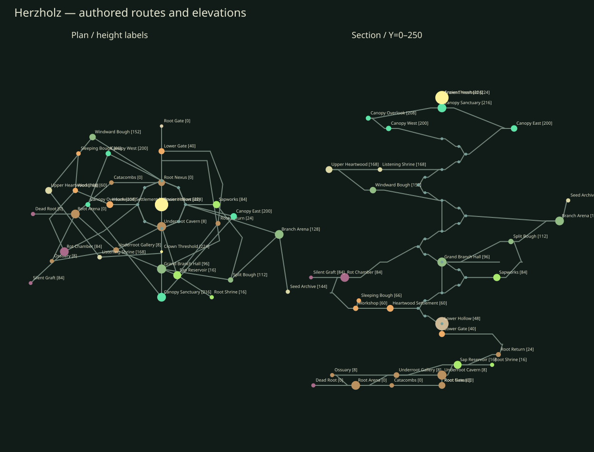

# Herzholz — Der hohle Weltenstamm

The original 80-unit trunk remains at XZ=(0,0). Its gatehouses and entrance stay
at Y=0; its staircase, plinth and arena move upward by 40 units so a root dungeon
can occupy the space beneath them. The original arena is now the Lower Hollow
at Y=48. The crown arena is at Y=224. Playable spaces span approximately 350 units
east–west; the complete visible silhouette spans 374 by 259 units and reaches
Y=258. The central hollow stays open between the lower arena and crown, with
perimeter ledges and two inclined roots crossing its center.



This is authored content, not a runtime procedural system. `tree_dungeon.py`
exports the existing prefab schema. `tree_dungeon_core.json` preserves the old
130-object composition as the source for retained architecture. Eight small new
models supplement all fifteen original models, which remain unchanged. The
largest new model is the 32-shape furniture set extracted from the old rooms.

## Progression and connections

The original southern gate leads into the Root Nexus. The long western route
passes Catacombs, Root Arena and Underroot Gallery. The direct Nexus–Underroot
Cavern connection rejoins that route below the trunk, forming the first loop.
The Ossuary is a second route around the Root Arena; Dead Root is a quiet dead
end. Sap Reservoir and Root Return lead up a broad eastern root to the original
staircase and Lower Hollow. Root Shrine is an optional reservoir excursion.

The inner cambium climb uses 25 landing knots over three circuits, at Y=48–192.
Its 6.5-unit treads follow the inner wall; the center is left open. At Y=60,
Heartwood Settlement branches through Workshop and Sleeping Bough. The Rot
Chamber reconnects at Y=108, creating a long alternative to the inner climb.
The lower settlement and corrupted tissue remain visibly distinct from the
living sap channels on the opposite side.

At Y=84, Sapworks connects to the eastern branch network. At Y=96, the southern
bark opening leads around the exterior to Grand Branch Hall and Split Bough.
Branch Arena reaches X=150 and returns through the east bark at Y=132. Seed
Archive is the farthest optional eastern branch. At Y=144, Windward Bough leads
out west through Upper Heartwood and Listening Shrine, returning north at Y=168.
Both branch loops have broad intermediate combat/rest spaces and rooted support.

The final split starts at Y=180 on the east and Y=192 on the southwest. Canopy
East and the West–Overlook route reunite in Canopy Sanctuary at Y=216. Its north
approach climbs to Crown Threshold, then crosses into the original 76-unit arena
model at Y=224. The old arena rim is rotated to open north. The heart hangs above
the arena, leaving its floor clear. Looking outward shows both canopy routes and
several earlier branch levels.

Two inclined roots cross the Grand Hollow from Y=72 to 96 and Y=120 to 144.
Each replaces roughly 98 units around half a spiral with a 66-unit crossing,
including landing interiors. The Nexus–Cavern connection bypasses approximately
200 units of western root exploration. All connections work in both directions;
there are no fictitious locked doors, required jumps, or irreversible drops.
The graph has 57 destinations (32 named spaces plus 25 inner knots), 66 links
and ten independent cycles.

There are eight major regular combat cores and a final boss core. Thirty-eight
authored guards occupy supported floors across the districts. Smaller rooms,
six optional excursions and narrowing root vaults break up the larger fights.
Combat centers stay open, with bark folds and grown ribs around their edges.
The original four furnished gatehouse rooms remain at the entrance. Reused
workbenches/storage, sleeping pods, shrines and observation ledges extend the
inhabited spaces without converting the tree into a conventional building.

## Measured original assets

These are local geometry bounds, including rotated shapes, not guessed sizes.
Sphere and crystal bounds are conservative transformed primitive bounds.
All rotations are radians; Y is up; the entrance faces negative Z.

| Model | Shapes | Local bounds / traversal use |
| --- | ---: | --- |
| foundation | 2 | X ±40, Y -80.6…-0.6, Z -108…40; solid foundation, never a hollow shell |
| walkway | 35 | X ±32, Y -0.56…0.07, Z -40…28; 64×68 slab, origin offset along Z |
| staircase | 32 | X ±14, Y 0…8, Z 0…24; 0.25 rise, 0.75 tread, climbs +Z |
| arena_floor | 193 | XZ ±38, Y -0.6…0.04; cylinder plus three growth-ring inlays |
| arena_rim | 55 | outer radius about 39, height 3; south entrance gap |
| arena_plinth | 2 | X ±38, Z -40…38, Y -0.3…7.9; solid, with south stair landing |
| bark_stave | 4 | 6.4 wide, Y 0…64, Z -3.65…3.35; split vertically for actual openings |
| bark_crown | 1 | X ±3.35, Y 61…67, Z ±3.25; decorative rounded top, not a floor |
| root | 4 | X -4…7.35, Y -2.68…18.67, Z -2.26…24.34; steep segmented buttress, not a ready-made ramp |
| branch | 3 | X -1.95…16.8, Y -1.56…19.03, Z -8.59…5.27; fork rises steeply, requires a separate tread |
| foliage | 3 | X -16…19.5, Y -7…8, Z -10.5…14.5; visual canopy only |
| wooden_gate | 5 | X ±17.5, Y 0…34.75, Z ±3; clear opening 25 wide between posts |
| lantern | 3 | XZ ±1.5, Y 0…7.3; green point light at Y=5, radius 16, intensity 3, no shadow |
| furnished_rooms | 260 | X ±31.5, Y 0.04…10.44, Z -102.7…-67.3; four entrance rooms, not a centered room module |
| approach_step | 1 | unit cube with top at Y=0; retained terrain-dependent entry treads |

The other dungeon prefabs and their model conventions were inspected before
authoring. The existing mushroom ramp rises 8 over 24; its neutral floor plate
and the cage catwalk/landing have useful dimensions but different materials.
Herzholz instead reuses its own palette and small grown modules. Existing
triangle collision supports the sloped bridge faces. Controller limits are a
0.4-radius, 2.4-high capsule and a 0.5 step. The new models use only supported
Cube, Cylinder, Frustum and Crystal primitives and existing material fields.

## Integration and validation

The terrain is a heightfield without caves. The Underroot is therefore enclosed
inside the raised root mantle, above the terrain, rather than placed invisibly
below an unmodified ground surface. The game surveys the expanded footprint and
reserves it against forest generation. Herzholz moves to radius 620 in its
existing northwest quadrant to avoid other dungeons. The entire prefab remains
in its owner's chunk; its footprint fits inside the five-chunk loading radius.
The game-side changes only adjust this reservation, placement, guard positions
and the existing boss-height function. No engine or shader changes are required.

```powershell
python scripts/tree_dungeon.py --phase blockout
python scripts/tree_dungeon.py --phase lit
python scripts/tree_dungeon.py --audit
```

The default export is the final lit dungeon. `--audit` is read-only and requires
the prefab to match its authoring source. It checks all asset references, fields,
transforms, material indices and CRLF; triangle floor support and clearance on
every route; step discontinuities; the player's supporting footprint; guard and
boss positions; clear combat cores; world reservations and streaming bounds.
Route samples include three lateral lanes at half-unit intervals. Rounded
decorative primitives are checked as conservative obstruction volumes, not used
as walk surfaces. Geometry and graph checks are complementary: a connected graph
alone does not pass the audit.

The blockout passed before detail, and the complete decorated layout passed
again after support, foliage, furniture and lighting adjustments. The final
audit covers 25,086 route samples, 38 guards, the boss and nine combat cores.
The Debug game target and required engine dependency build successfully. A
geometry-based exterior/cutaway preview was reviewed for spatial composition.
These are static content and build checks; no in-game controller/camera/combat
playthrough has been performed. Darker root districts use sparse existing lights
and occluding root mantles; no new district lighting or fog system is implied.
